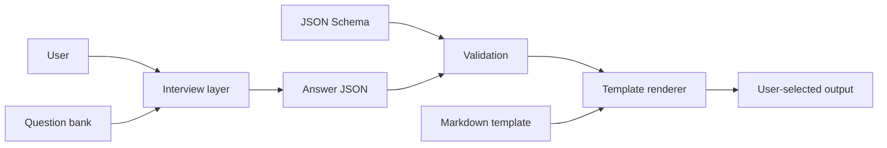

# Context File Maker

An interview-and-generation toolkit for structured AI context files, starting with the free-tier `about_me.md` and `ai_preferences.md`.

**Status:** v0.1.3 — free-tier templates, schemas, deterministic generator, and validation tests implemented. Cursor interview flow still needs an end-to-end product test. Paid-tier catalog is future scope.  
**Repo:** `andrewsetness/project-context-file-maker`

This repository is self-contained. A fresh clone can read the product, generate files from JSON answers, and run the validator/tests without any sibling repo.

## Mental model

There are two distinct layers:

1. **Interview layer** — an agent asks the questionnaire and produces structured answers.
2. **Generator layer** — `scripts/generate.py` validates answer JSON against `schemas/`, then deterministically renders `templates/free/`.

The CLI is not itself an autonomous interview engine. See [`docs/DATA-CONTRACT.md`](docs/DATA-CONTRACT.md) for the full source-of-truth, privacy, and output contract.



## Quick start

### Cursor interview path

1. Open the project workspace.
2. Read `STATUS.md` and `docs/DATA-CONTRACT.md`.
3. Say `build my context files` or `create an about me file`.
4. Keep real interview answers and generated profiles in a private/user-owned destination, **not** in `output-examples/` or `tests/fixtures/`.

The Cursor interview flow is implemented as prompts/skills but is still an open end-to-end validation item; do not treat the CLI tests as proof that the conversational UX has been validated.

### Deterministic CLI path

```powershell
python scripts/generate.py about_me --answers C:\private\about_me.json --output C:\private\about_me.md
python scripts/generate.py ai_preferences --answers C:\private\prefs.json --output C:\private\ai_preferences.md
python scripts/generate.py all --about C:\private\about_me.json --prefs C:\private\prefs.json --outdir C:\private\context
```

Without `--output`, a single-file command prints to stdout. The generator does not silently write personal data into the repository.

Invalid payloads fail before output is written when required fields are missing or known fields have the wrong type.

## Free tier

| File | Purpose | Interview target |
|---|---|---|
| `about_me.md` | Identity, role, stack, goals, work context | ~3 min |
| `ai_preferences.md` | Tone, code/work style, constraints, pet peeves | ~2 min |

The time figures are design targets, not measured usability claims until the Cursor interview is tested with users.

## Canonical sources

Do not treat every markdown file as a second spec. Use this map; other docs should link here instead of restating the same rules.

| Concern | Canonical file |
|---|---|
| What questions are asked | `docs/questionnaires/*.md` |
| Structured field names/types/required fields | `schemas/*_answers.schema.json` |
| Markdown output structure | `templates/free/*.md` |
| Runtime validation + generation | `scripts/generate.py` |
| Contract consistency (schema/question/template/fixtures) | `scripts/validate.py` + tests |
| Privacy, output destination, example-data rules | `docs/DATA-CONTRACT.md` |
| Product intent and free-tier requirements | `PRD.md` |
| Current implementation state | `STATUS.md` |
| Interview identity / hard limits | `SOUL.md` |
| Conversational execution sequence | `.cursor/skills/context-file-maker/SKILL.md` |

If these disagree, fix the disagreement. Do not invent or silently coerce user facts.

`HANDOFF.md`, `JOBS_TO_BE_DONE.md`, `ARCHITECTURE.md`, `agents/context-file-maker-agent.md`, and `SKILL.md` are operating or narrative views. They must defer to the table above when they overlap.

## License and releases

**Unresolved owner decision:** this public repository has no license file and no published GitHub Release process. Do not invent a license (MIT, Apache, proprietary, or otherwise) or publish version tags until the owner records that decision here.

Until then:

- treat the code as source-available without a granted reuse right;
- use `CHANGELOG.md` only as in-repo history, not as a release channel.

## Tracked examples are synthetic

`output-examples/` and `tests/fixtures/` are public-safe demonstration/test data only. They must never contain a real user's profile, employer facts, private goals, credentials, or account data.

The examples are **not an output directory**. User-generated context files belong at the path the user explicitly selects.

## Paid tier

The catalog contains 60+ proposed context files across 14 categories under `templates/paid/CATALOG.md`. They are catalog/design scope only until each file type has a questionnaire, schema, template, generator routing, synthetic fixtures, tests, and example output as required by the data contract.

## Required reading

For contributors, read in this order:

1. `STATUS.md` — what is actually implemented now
2. `docs/DATA-CONTRACT.md` — data flow, privacy, and authority
3. `PRD.md` — intended product behavior
4. `AGENTS.md` — contributor/agent rules
5. `.cursor/skills/context-file-maker/SKILL.md` — only if changing the interview UX

Historical session detail belongs in `CHANGELOG.md`/`HANDOFF.md`, not in the current-state contract.

## Project structure

```text
project-context-file-maker/
├── README.md
├── STATUS.md
├── ARCHITECTURE.md
├── schemas/                       # machine-readable answer contracts
├── templates/free/                # deterministic markdown templates
├── docs/
│   ├── DATA-CONTRACT.md           # authority, privacy, output lifecycle
│   └── questionnaires/            # interview question banks
├── scripts/
│   ├── generate.py                # validate JSON → render markdown
│   ├── template_engine.py
│   └── validate.py
├── tests/                         # synthetic fixtures + regression tests
└── output-examples/               # synthetic examples only; never user output
```

## Verification

```powershell
python -m pytest -q
python scripts/validate.py --strict
```

Do not claim the Cursor interview UX is validated merely because the deterministic generator/tests pass.
