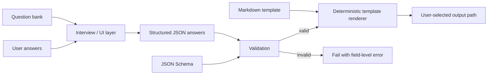

# Context File Maker Data Contract

**Status:** current  
**Last reviewed:** 2026-08-18

## Purpose

This document defines the boundary between conversational interviewing, structured answers, deterministic generation, examples, and user-owned output.

The repository contains templates and tooling. It is **not** a storage location for a user's personal context profile.

## Source-of-truth hierarchy

For the free tier:

1. `docs/questionnaires/*.md` defines what the interview asks and how questions are presented.
2. `schemas/*_answers.schema.json` defines the machine-readable answer contract: field names, required fields, and types.
3. `templates/free/*.md` defines deterministic output structure.
4. `scripts/generate.py` validates structured answers against the checked-in schema contract before rendering.
5. The generated markdown at the **user-selected destination** is the user's artifact.

If these layers disagree, fix the disagreement. Do not silently coerce or invent missing user facts.

## Interview layer versus generator

The conversational agent and the CLI are separate components:

- The **interview layer** may ask follow-up questions, explain fields, and collect responses.
- The **generator** accepts structured JSON only. It does not infer omitted required facts from prose or prior chats.
- The renderer is deterministic: identical validated answer payload + identical template version should produce identical markdown.

Do not describe the CLI itself as an autonomous interview engine.

## Validation contract

Generation must fail before writing output when:

- the answer file is missing or malformed JSON;
- the payload is not a JSON object;
- a schema-required field is absent;
- a known field has the wrong JSON type;
- the checked-in schema uses a construct the runtime validator does not support.

The current free-tier schemas allow additional properties because they do not set `additionalProperties: false`. The runtime preserves that behavior.

If schemas begin using more advanced JSON Schema constructs, either extend the dependency-free validator with tests or deliberately adopt a JSON Schema library. Never silently ignore a schema rule.

## Privacy and storage

Interview data can include identity, employer, location/timezone, professional goals, work habits, preferences, and other personal context. Treat answer JSON and generated context files as user data.

Rules:

- Do not commit real user answer payloads or generated personal profiles to this repository.
- Do not use `output-examples/` as the destination for a real interview.
- `output-examples/` and `tests/fixtures/` must contain **fictional/synthetic data only**.
- Default CLI behavior is stdout unless the user supplies `--output`/`--outdir`; this avoids silently persisting personal data.
- If an interview UI writes intermediate answer JSON, it must make the destination explicit and should use a user-owned, ignored/private location.
- Do not add telemetry, cloud persistence, or third-party transmission of interview answers without an explicit product decision and privacy review.
- Secrets, credentials, account numbers, authentication tokens, and private keys are out of scope and should never be requested for context-file generation.

## Example-data policy

Tracked examples exist to demonstrate shape and quality, not to preserve a real person's profile.

Every tracked example or fixture must:

- use a clearly fictional person/organization;
- avoid real employer/project/customer facts;
- avoid real contact details, account identifiers, precise addresses, or credentials;
- be safe to publish even if repository visibility changes later.

A contributor who wants to reproduce a personal run should create an untracked answer file outside `output-examples/` and pass its path to the CLI.

## Output destination contract

The CLI has no magical default user folder:

- no `--output`: rendered markdown goes to stdout;
- single-file `--output`: writes exactly that path;
- `all --outdir`: writes `about_me.md` and `ai_preferences.md` in that directory.

The tool may create the parent output directory when needed. It must not silently redirect output into `output-examples/`, the repository root, or a shared profile directory.

## Versioning

A generated file is derived from three versioned inputs:

- answer schema;
- markdown template;
- generator/runtime behavior.

Material changes to field semantics or output meaning should be noted in `CHANGELOG.md`. If backward compatibility breaks, update schema/version documentation and migration guidance rather than reinterpreting old answer files silently.

## Definition of done for a new context-file type

A new generated file is not implemented until all of the following exist and agree:

1. questionnaire/interview fields;
2. JSON answer schema;
3. markdown template;
4. generator routing;
5. valid full and minimal synthetic fixtures;
6. validation and generation tests;
7. synthetic example output;
8. privacy/output behavior documented where it differs from this contract.
